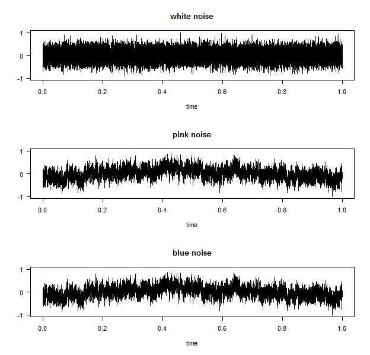
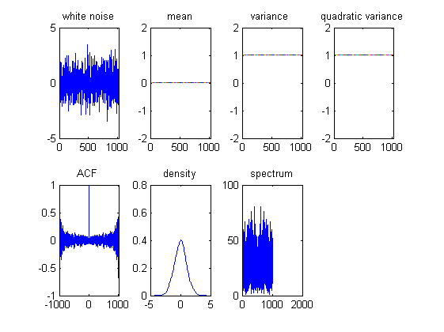
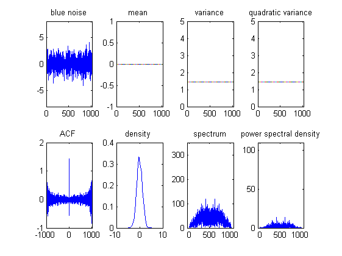
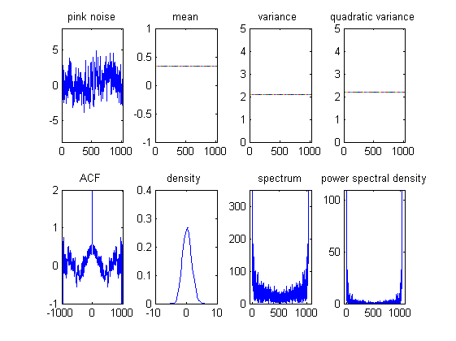

# SFM03different-noise
Generate and plot white, pink, and blue noise and explain its difference
[](http://quantlet.de/index.php?p=info)

## [](http://quantlet.de/) **SFM03different-noise** [](http://quantlet.de/d3/ia)


```yaml
Name of Quantlet: SFM03different-noise

Published in: Statistics of Financial Markets

Description: 'Generates and plots white, pink, and blue noise and explain its difference'

Keywords: 'plot, graphical representation, white noise, pink noise, blue noise '

Author: qiangzhang weixiong jinxinwang guangyu

Submitted:  2016/07/13

Output: 'plot of white, pink, and blue noise '

```





# R code
```r
# Clear enviorenment
graphics.off()
rm(list = ls())
libraries = c("tuneR")
lapply(libraries, function(x) if (!(x %in% installed.packages())) {
  install.packages(x)
})
lapply(libraries, library, quietly = TRUE, character.only = TRUE)

libraries = c("audio")
lapply(libraries, function(x) if (!(x %in% installed.packages())) {
  install.packages(x)
})
lapply(libraries, library, quietly = TRUE, character.only = TRUE)

library(tuneR)
library(audio)
w <-noise(kind = c("white"))
p <-noise(kind = c("pink"))
b <-noise(kind=c("power"))
par(mfrow=c(3,1))
plot(w,main="white noise")
plot(p,main="pink noise")
plot(p,main="blue noise")
writeWave(w,"w.wav")#writes pink noise on your hard drive
writeWave(p,"p.wav")#loads `audio` package to use `load.wave` function
writeWave(b,"b.wav")


```











#  Matlab code
```matlab
%creat white noise
clf;
y=wgn(1,1024,0);
t=0:1023;
y1=mean(y);%mean 01
y2=var(y);%mean
y3=y2+y1.*y1;% quadratic mean
[y4,lag]=xcorr(y,'unbiased');%ACF
[f1,y5] = ksdensity(y);%density
f=(0:length(y)-1)'/length(y)*1024;
Y=fft(y);
y6=abs(Y);% frequency spectrum
y7=Y.*conj(Y)/1024;% power spectral density
figure(1);
subplot(2,4,1);plot(t,y);
title('white noise');axis([0 1024 -5 5]);
subplot(2,4,2);plot(t,y1);
title('mean');axis([0 1024 -2 2]);
subplot(2,4,3);plot(t,y2);
title('variance ');axis([0 1024 -2 2]);
subplot(2,4,4);plot(t,y3);
title('quadratic variance ');axis([0 1024 -2 2]);
subplot(2,4,5);plot(lag,y4);
title('ACF ');axis([-1024 1024 -1 1]);
subplot(2,4,6);plot(y5,f1);
title('density');
subplot(2,4,7);plot(f,y6);
title(' spectrum ');

%low pass filter
Wp=2*pi*30;Ws=2*pi*40;Rp=0.5;Rs=40;fs=100;W=2*pi*fs;
[N,Wn]=buttord(2*Wp/W,2*Ws/W,Rp,Rs);
[b,a]=butter(N,Wn);
[h,f]=freqz(b,a,1000,fs);
% Attenuation of 3 db octave filter
a=[0.98443604 0.83392334 0.07568359];
b=[0.99572754 0.94790649 0.53567505];
Hz = zpk(a,b,1,1/44100);
Hz2=get(tf(Hz))
num = cell2mat(Hz2.num());
den = cell2mat(Hz2.den(1));
[H F]=freqs(den,num);

%creat pink noise
pn=filter(num,den,y);
 pn1=mean(pn); 
pn2=var(pn); 
pn3=pn2+pn1.*pn1; 
[pn4,lag]=xcorr(pn,'unbiased'); 
[f1,pn5]=ksdensity(pn); 
f=(0:length(pn)-1)/length(pn)*1024;
PN=fft(pn);
pn6=abs(PN); 
pn7=PN.*conj(PN)/1024; 
figure(5);
subplot(2,4,1);plot(t,pn);
title('pink noise');axis([0 1024 -8 8]);
subplot(2,4,2);plot(t,pn1);
title('mean');axis([0 1024 -1 1]);
subplot(2,4,3);plot(t,pn2);
title('variance ');axis([0 1024 0 5]);
subplot(2,4,4);plot(t,pn3);
title('quadratic variance ');axis([0 1024 0 5]);
subplot(2,4,5);plot(lag,pn4);
title('ACF ');axis([-1024 1024 -1 2]);
subplot(2,4,6);plot(pn5,f1);
title('density ');
subplot(2,4,7);plot(f,pn6);
title(' spectrum ');axis([-50 1080 0 350]);
subplot(2,4,8);plot(f,pn7);
title(' power spectral density ');axis([-50 1080 0 110]);

% low pass filter 
Wp=2*pi*30;Ws=2*pi*40;Rp=0.5;Rs=40;fs=100;W=2*pi*fs;
[N,Wn]=buttord(2*Wp/W,2*Ws/W,Rp,Rs);
[b,a]=butter(N,Wn);
[h,f]=freqz(b,a,1000,fs);
% Octave enhanced 3 db filter
a=[0.98443604 0.83392334 0.07568359];
b=[0.99572754 0.94790649 0.53567505];
Hz = zpk(b,a,1,1/44100); 
Hz2=get(tf(Hz))
num = cell2mat(Hz2.num());
den = cell2mat(Hz2.den(1));
[H F]=freqs(den,num);

%creat blue noise
pn=filter(num,den,y); 
pn1=mean(pn); 
pn2=var(pn); 
pn3=pn2+pn1.*pn1; 
[pn4,lag]=xcorr(pn,'unbiased'); 
[f1,pn5]=ksdensity(pn); 
f=(0:length(pn)-1)/length(pn)*1024;
PN=fft(pn);
pn6=abs(PN); 
pn7=PN.*conj(PN)/1024; 
figure(7);
subplot(2,4,1);plot(t,pn);
title('blue noise');axis([0 1024 -8 8]);
subplot(2,4,2);plot(t,pn1);
title('mean ');axis([0 1024 -1 1]);
subplot(2,4,3);plot(t,pn2);
title('variance');axis([0 1024 0 5]);
subplot(2,4,4);plot(t,pn3);
title('quadratic variance');axis([0 1024 0 5]);
subplot(2,4,5);plot(lag,pn4);
title('ACF ');axis([-1024 1024 -1 2]);
subplot(2,4,6);plot(pn5,f1);
title('density ');
subplot(2,4,7);plot(f,pn6);
title(' spectrum ');axis([-50 1080 0 350]);
subplot(2,4,8);plot(f,pn7);
title(' power spectral density ');axis([-50 1080 0 110]);
```

